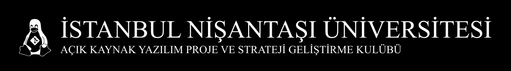

# Blog

This projects is developed by the members of the **Nişantaşı University Open Source Software Development Club.** The aim of the project is to create a blog site with the club members.

**Stack:**

-  Nuxt
-  Nuxt Content
-  Tailwind CSS

## Development Setup

```bash
# install dependencies
$ bun install

# serve with hot reload at localhost:3000
$ bun dev
```

## Contributing

If you want to contribute to this project and make it better, your help is very welcome. Pick an issue and send a pull request! Don't forget to use semantic commit messages, for example:

```bash
# add new feature
$ git commit -m "feat: add new feature"

# fix a bug
$ git commit -m "fix: fix a bug"

# refactor code
$ git commit -m "refactor: refactor code"

# style changes (doesn't matter css or not)
$ git commit -m "style: increase the size of the button"

# for adding or removing a component
$ git commit -m "component: add new component"
```
